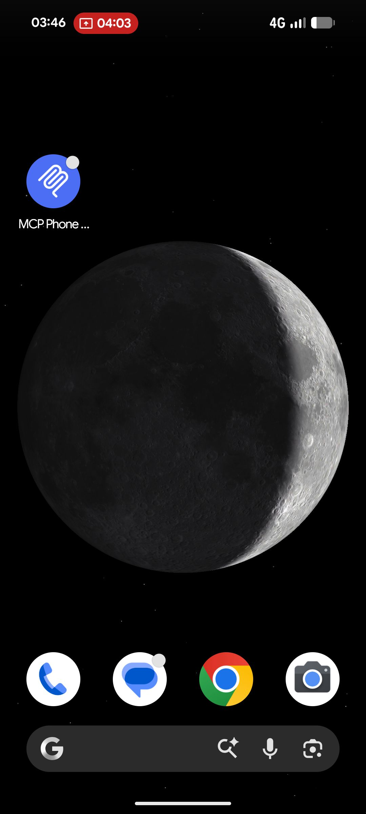
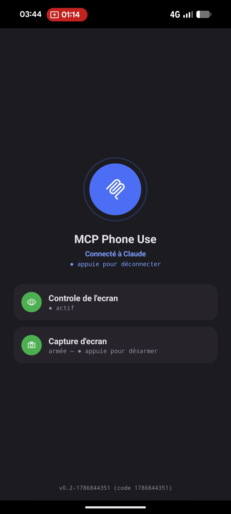

# MCP Phone Use

*[Lire en français](README.fr.md)*

[](LICENSE)
[](https://github.com/nic01asFr/MCP-Phone-Use/releases/latest)
[](https://modelcontextprotocol.io)

Gives an MCP-compatible AI assistant real, secure access to an Android phone — perception (reading the screen, taking a screenshot) and action (tap, swipe, type text, launch apps) — without ever needing ADB or a local computer, neither for everyday use nor for debugging.

<p align="center">
  
  &nbsp;&nbsp;
  
</p>

> **Self-hosted.** This isn't an MCP server you spin up locally with a single command. You need to host the relay yourself (Python, public HTTPS URL). Expect 30-60 minutes for a first deployment — see [Installation](#installation).
>
> **Ready-to-use APKs**: [latest release](https://github.com/nic01asFr/MCP-Phone-Use/releases/latest) — no need to compile the Android app yourself, only the relay still needs deploying.

## What it does

Three tools exposed via MCP:

- **`get_ui_tree`** — reads the accessibility hierarchy of the foreground app (text, clickable elements, position), regardless of which app is active
- **`device_action`** — `tap`, `swipe`, `type_text`, `key` (back/home/recents/notifications), `launch_app`
- **`get_screen`** — real screenshot (JPEG), for anything accessibility alone can't see (visual rendering, WebView content, poorly-accessible apps)

The first two rely on an `AccessibilityService`; the third on `MediaProjection` (armed separately, system consent prompt on every session, never bundled with the connection itself).

## Architecture

```
MCP-compatible AI assistant (Claude, or any other MCP client)
        │  OAuth 2.1 + PKCE, Streamable HTTP
        ▼
   MCP relay (your own hosting)
   auth server + resource server
        ▲
        │  outbound connection, challenge-response (Keystore key)
   Android app (MCP Phone Use)
   AccessibilityService + MediaProjection
```

The phone connects **outbound** to the relay — no ADB, no NAT traversal, no open port on the phone's side. Full detail in [`docs/architecture.md`](docs/architecture.md).

## Security

- **Double lock** — no tool responds unless both conditions are met: valid OAuth session *and* app connected on the phone's side
- **No static token** — the app proves its identity through a cryptographic signature (Android Keystore key pair, non-exportable) on every connection, never through a secret sent in the clear
- **Rate-limiting** — bounded attempt count, per IP, on entry points with a guessable secret (login, enrollment) — tested under a real attack, see [`SECURITY.md`](SECURITY.md)
- **Non-bypassable human consent** — the assistant can bring the user to a system consent popup (accessibility, screen capture), but never taps it itself; the final gesture always stays human, by design, not by technical limitation

Full detail on the security model, the tests actually performed, and the known limitations: [`SECURITY.md`](SECURITY.md).

## Installation

### 1. Deploy the relay

The relay (`relais/`) needs to run continuously, reachable from the internet over HTTPS — the phone connects to it outbound, and Claude calls it like any regular MCP server. A [`Dockerfile`](Dockerfile) is provided for generic deployment on any hosting (VPS, cloud pod...). See [`CONTRIBUTING.md`](CONTRIBUTING.md) for the full commands, or [`relais/README.md`](relais/README.md) for detail without Docker.

### 2. Install the Android app

The app is distributed outside the Play Store, which by default triggers Android's "Restricted Settings" block, preventing accessibility from being enabled. Clean workaround, no ADB needed: a **dedicated installer** using `PackageInstaller` in session mode (the same mechanism Play Store/F-Droid use), which installs `MCP Phone Use` with enough trust status to avoid that block.

1. Download the installer from the [latest release](https://github.com/nic01asFr/MCP-Phone-Use/releases/latest), sideload directly
2. Open the installer (the main APK's URL is already pre-filled), tap "Download and install"
3. Open the app, enter the pairing code given by your assistant (single-use, 10 min)
4. Enable accessibility and, if needed, arm screen capture

## Status

Complete groundwork, validated under real conditions: OAuth 2.1/PKCE, double lock, challenge-response, rate-limiting, wake lock (keeps the screen from turning off during an active capture), built-in crash reporter (`Thread.UncaughtExceptionHandler` + `ApplicationExitInfo`, no ADB needed).

Remaining backlog: persistence of the device registry on the relay side (currently in-memory, lost on every process restart).

## License

[MIT](LICENSE) — free to use, modify, and redistribute.
